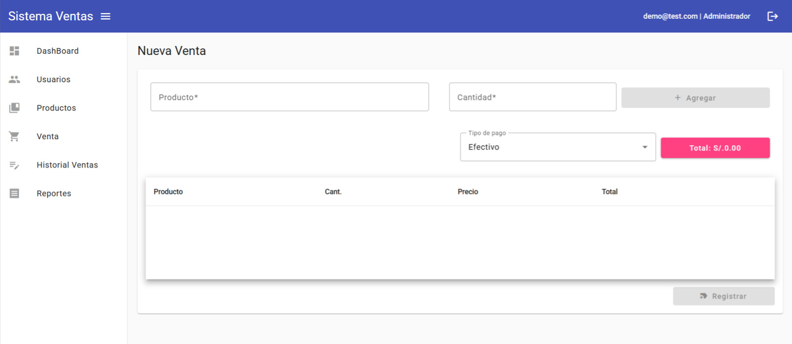

# AppSistemaVentas - Angular

This project was generated with [Angular CLI](https://github.com/angular/angular-cli) version 15.2.11.



### 📌 **Descripción del Proyecto**  

Este proyecto es una aplicación de ventas desarrollada con **Angular Material** y **ASP.NET Core 8**, basada en un curso de YouTube, pero con múltiples mejoras y optimizaciones. Se han agregado nuevas funcionalidades, simplificado el código y mejorado la experiencia de usuario.  

### 🚀 **Características Principales**  
🔹 **Interfaz moderna y responsiva**, adaptada a distintos dispositivos.  
🔹 **Gestión de ventas, productos y usuarios** con navegación intuitiva.  
🔹 **Autenticación segura con JWT**, protegiendo el acceso a los recursos.  
🔹 **Interacción con una API REST** para el manejo eficiente de datos.  
🔹 **Filtros avanzados en tablas reutilizables**, permitiendo búsquedas dinámicas.  
🔹 **Generación de reportes y estadísticas** para el análisis de ventas.  
🔹 **Menús dinámicos y personalizados** según el rol del usuario.  

### 💻 **Estructura del Sistema**  
✔️ **Menú de Usuarios** → Gestión de cuentas y permisos.  
✔️ **Menú de Productos** → Administración de inventario y stock.  
✔️ **Menú de Ventas** → Registro y seguimiento de transacciones.  
✔️ **Menú de Historial de Ventas** → Consulta de registros anteriores.  
✔️ **Menú de Reportes** → Visualización de estadísticas y gráficos.  
✔️ **Menú de Dashboard** → Panel con información clave en tiempo real.  
✔️ **Funciones de Usuario** → Menú dinámico, datos del usuario y opción de cerrar sesión.  

Este repositorio incluye el código fuente y los recursos necesarios para su desarrollo y despliegue.  


## Implemented Dependencies:
* Angular Material
```
ng add @angular/material@15.2.9
```
* Material-moment-adapter
```
npm i @angular/material-moment-adapter@15.2.9
```
* SweetAlert2
```
npm install sweetalert2
```
* Moment.js
```
npm install moment --save
```
* Chart.js
```
npm install chart.js@3.9.1
```
* Xlsx
```
npm i xlsx@0.18.5
```
* wt-decode
```
npm i jwt-decode@3.1.2
```
```
* jsPDF y jsPDF-AutoTable
```
npm i jspdf jspdf-autotable
```

<br/>

> [!NOTE]
> Install dependencies for running this project
> `npm install`
